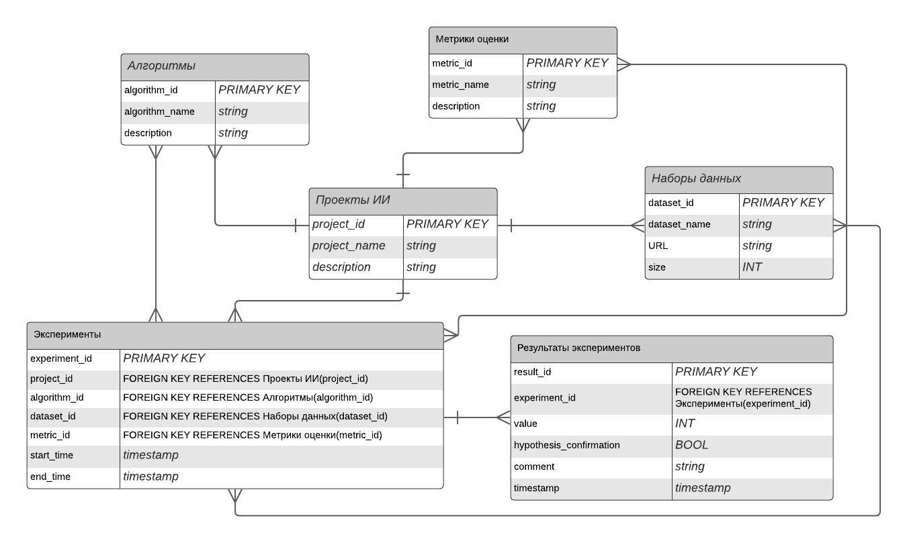
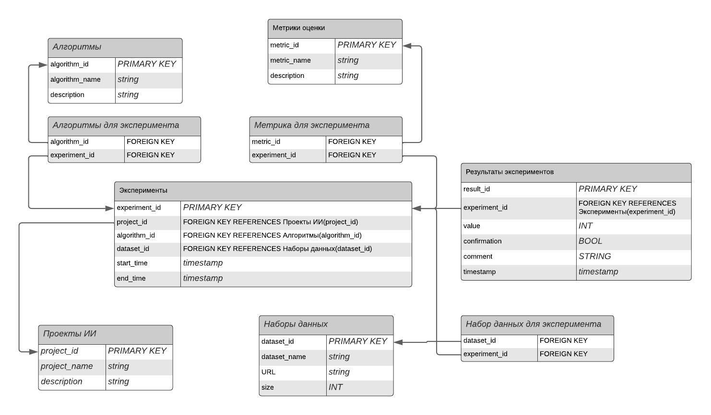

# Проект по курсу "Базы данных"
В данном репозитории представлен мой личный проект по курсу БД на тему обучения исскуственного интеллекта.

## Предметная область: Обучение искусственного интеллекта
Проект направлен на систематизацию и анализ результатов экспериментов, проводимых в области искусственного интеллекта и машинного обучения. Он охватывает разнообразные алгоритмы, наборы данных и метрики оценки, используемые для измерения эффективности и точности алгоритмов машинного обучения.

Целью проекта является облегчение сравнительного анализа различных подходов и ML технологий, а также предоставление платформы для обмена знаниями и опытом между учеными и инженерами, работающими в этой области.

## Сущности
1. **Проекты ИИ**: Основные проекты, проводимые в области искусственного интеллекта, включая описание, цели, сроки и участников
2. **Алгоритмы**: Различные алгоритмы машинного обучения, используемые в рамках проектов, с описанием их типов и особенностей.
3. **Наборы данных**: Наборы данных, используемые для обучения и тестирования ML алгоритмов, с описанием их типов, размеров и структуры.
4. **Метрики оценки**: Метрики, используемые для оценки эффективности и точности ML алгоритмов, с описанием их методологии и подходов к интерпретации результатов.
5. **Эксперименты**: Эксперименты, проводимые в рамках проектов ИИ, включая информацию о применяемых алгоритмах, наборах данных и метриках оценки, а также временные рамки проведения экспериментов.
6. **Результаты экспериментов**: Результаты экспериментов, представленные в виде значений метрик оценки, полученных для конкретных экспериментов и алгоритмов.

## Концептуальная модель

## Логическая модель (3NF)

## Физическая модель
Физическая модель представлена в данной гугл таблице: https://docs.google.com/spreadsheets/d/16XFdbRY38UGQOfLI8A4TkrIBBlsm3_1ji_eA5BDjO-0/edit?usp=sharing.

Также она доступна в папке docs.
## SELECT запросы и тесты к ним
Описания запросов scripts/selects(task6).py
1. Запрос с использованием GROUP BY и HAVING:
Извлекает среднюю оценку по каждому проекту, где средняя оценка больше 0.9.

2. Запрос с использованием ORDER BY:
Возвращает результаты экспериментов, отсортированные по убыванию значения метрики.

3. Запрос с использованием функции агрегирования (AVG) OVER PARTITION BY:
Для каждого эксперимента вычисляет среднее значение метрики в рамках каждого проекта.

4. Запрос с использованием функции ранжирования (RANK) OVER ORDER BY:
Для каждого эксперимента определяет его ранг в зависимости от значения метрики.

5. Запрос с использованием функции смещения (LAG) OVER PARTITION BY ORDER BY:
Возвращает значение метрики для предыдущего эксперимента в рамках каждого проекта.

6. Запрос с использованием функции агрегирования (AVG), функции ранжирования (RANK) и функции смещения (LAG) OVER PARTITION BY + ORDER BY:
Для каждого эксперимента вычисляет среднее значение метрики и его ранг в рамках каждого проекта и возвращает значение метрики для предыдущего эксперимента

Описание тестов tests/tests(task7).py:

1. Тест для запроса с использованием GROUP BY и HAVING:
Проверяет, что средняя оценка для каждого проекта больше 0.9.

2. Тест для запроса с использованием ORDER BY:
Проверяет, что результаты экспериментов отсортированы по убыванию значения метрики.

3. Тест для запроса с использованием функции агрегирования (AVG) OVER PARTITION BY:
Проверяет, что для каждого эксперимента вычислено среднее значение метрики в рамках каждого проекта.

4. Тест для запроса с использованием функции ранжирования (RANK) OVER ORDER BY:
Проверяет, что для каждого эксперимента определен его ранг в зависимости от значения метрики.

5. Тест для запроса с использованием функции смещения (LAG) OVER PARTITION BY ORDER BY:
Проверяет, что возвращается значение метрики для предыдущего эксперимента в рамках каждого проекта.

6. Тест для запроса с использованием функции агрегирования (AVG), функции ранжирования (RANK) и функции смещения (LAG) OVER PARTITION BY + ORDER BY:
Проверяет, что для каждого эксперимента вычислено среднее значение метрики и его ранг в рамках каждого проекта.

## Индексы (scripts/indices(task8).sql)

1. Experiments.project_id: Это поле будем часто использовать при поиске всех экспериментов, связанных с определенным проектом.

2. ExperimentResults.experiment_id: Это поле будем также часто использовать при поиске результатов для определенного эксперимента.

3. CREATE INDEX idx_datasets_dataset_name ON Datasets (dataset_name) - Этот индекс ускоряет поиск по названию набора данных в таблице Datasets. 

4. CREATE INDEX idx_projects_project_name ON Projects (project_name) - Аналогично предыдущему, этот индекс ускоряет поиск по названию проекта в таблице Projects. 

5. ExperimentDatasets.dataset_id: Это поле используем при поиске всех экспериментов, в которых использовался определенный набор данных.

